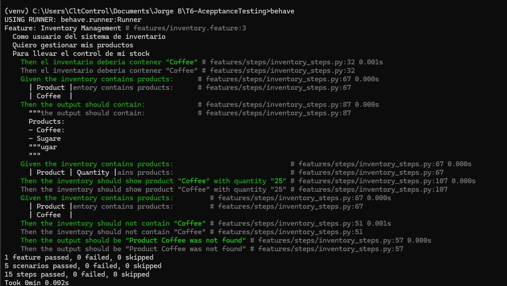

# Practice Report: Acceptance Test Workshop

## Cover

**Institution:** Escuela Superior Politecnica del Litoral

**Faculty:** Faculty of Electrical and Computer Engineering

**Course:** Software Engineering II

**Workshop:** Acceptance Test Workshop - I Term 2026

**Project:** Inventory Manager

**Repository:** https://github.com/Jonthz/T6-AcepptanceTesting

**Date:** July 7, 2026

**Team Members:**

| Member | Name | Project Role |
| --- | --- | --- |
| Member 1 | Jorge Bravo Vidal | Technical Lead / Developer |
| Member 2 | Jonathan Paul Zambrano Arriaga | BDD Developer |
| Member 3 | Giovanni Sambonino | BDD Developer |
| Member 4 | Darwin Pacheco | QA Specialist |
| Member 5 | Ricardo Asanza | BDD Developer |
| Member 6 | Luis Abrahan Cedeno Arteaga | Release Manager |

## Introduction

This report documents the development and validation of an Inventory Manager project through acceptance testing. Acceptance testing verifies whether a system satisfies user needs, business requirements, and acceptance criteria before delivery.

The workshop follows the Behavior Driven Development (BDD) approach. BDD expresses system behavior through scenarios that can be understood by both technical and non-technical stakeholders. These scenarios are written with Gherkin syntax, using steps such as `Given`, `When`, and `Then`.

The assignment introduces Cucumber as the framework for writing Gherkin-based acceptance tests. In this Python project, the team used Behave, a Python BDD framework that supports Gherkin feature files and step definitions. The tested system is a command-line Inventory Manager that allows users to add, list, update, remove, and search products.

## Objectives

- Validate the correct behavior of the Inventory Manager through acceptance tests.
- Define system behavior using Gherkin scenarios.
- Automate the scenarios with Behave step definitions in Python.
- Execute the acceptance test suite and document the results.
- Review errors, apply corrections, and run the tests again.
- Provide evidence of team participation and rubric compliance.

## Project Scope

The Inventory Manager is a Python command-line application. Each product is represented with at least four attributes:

| Attribute | Description |
| --- | --- |
| `name` | Product name or identifier |
| `quantity` | Units available in stock |
| `price` | Unit price |
| `category` | Product category |

The project implements the four suggested functionalities from the assignment and one additional feature defined by the team:

| Feature | Functionality | Type | Status |
| --- | --- | --- | --- |
| Feature 1 | Add a product to the inventory | Suggested | Implemented and validated |
| Feature 2 | List all products in the inventory | Suggested | Implemented and validated |
| Feature 3 | Update the quantity of a product | Suggested | Implemented and validated |
| Feature 4 | Remove a product from the inventory | Suggested | Implemented and validated |
| Feature 5 | Search a product by name | Additional | Implemented and validated |

## Repository Structure

```text
T6-AcepptanceTesting/
|-- README.md
|-- inventory.py
|-- requirements.txt
|-- features/
|   |-- inventory.feature
|   `-- steps/
|       `-- inventory_steps.py
`-- docs/
    |-- evidencia_behave.txt
    |-- reporte_practica.md
    `-- reporte_practica.docx
```

## Team Work Distribution

| Member | Name | Role | Responsibility | Evidence in the Project |
| --- | --- | --- | --- | --- |
| Member 1 | Jorge Bravo Vidal | Technical Lead / Developer | Base setup, initial structure, and add product feature | `inventory.py`, add product scenario |
| Member 2 | Jonathan Paul Zambrano Arriaga | BDD Developer | List products feature | Listing scenario and listing steps |
| Member 3 | Giovanni Sambonino | BDD Developer | Update quantity feature | Update quantity scenario and assertions |
| Member 4 | Darwin Pacheco | QA Specialist | Remove product feature and failed interaction | Successful and failed remove scenarios |
| Member 5 | Ricardo Asanza | BDD Developer | Additional search feature | Search scenarios and filtering logic |
| Member 6 | Luis Abrahan Cedeno Arteaga | Release Manager | Integration, test execution, corrections, and report | `docs/evidencia_behave.txt`, final report, PR branch `lacedeno` |

## Part 1: Project Setup

The assignment requires preparing the repository, virtual environment, dependencies, and initial application execution. The following activities were completed:

1. The GitHub repository was created and updated.
2. A local virtual environment was prepared.
3. Project dependencies were installed from `requirements.txt`.
4. Behave was installed and verified.
5. The main application file, `inventory.py`, was reviewed.
6. The project structure was aligned with Behave conventions.

Environment setup commands:

```bash
python3 -m venv .venv
source .venv/bin/activate
pip install -r requirements.txt
```

Application execution command:

```bash
python inventory.py
```

### Project Setup Evidence

| Assignment Requirement | Evidence |
| --- | --- |
| Repository created | Repository link included in the cover and README |
| Virtual environment prepared | Local `.venv` used to install and run Behave |
| Behave installed | `requirements.txt` includes `behave==1.3.3` |
| Main file created | `inventory.py` |
| Behave structure created | `features/inventory.feature` and `features/steps/inventory_steps.py` |

## Part 1: Code Creation and Requirements Compliance

The `inventory.py` file implements the main logic of the Inventory Manager. The domain functions are:

| Function | Purpose |
| --- | --- |
| `add_product` | Adds products with name, quantity, price, and category |
| `find_product` | Searches products by name, case-insensitively |
| `list_products` | Displays existing products |
| `update_quantity` | Updates the quantity of an existing product |
| `remove_product` | Removes a product or returns an error message |
| `search_products` | Searches products by keyword |

The additional feature selected by the team was **search product by name**. This feature validates both successful searches and searches with no matches.

## Part 2: Feature File Creation

The file `features/inventory.feature` documents the acceptance scenarios in Gherkin. The assignment requires 5 features and at least 5 scenarios. The project contains 5 functionalities and 7 scenarios, which exceeds the minimum requirement.

| Scenario | Covered Feature | Type |
| --- | --- | --- |
| Add a product to the inventory | Add product | Successful flow |
| List all products in the inventory | List products | Successful flow with data table |
| Update the quantity of a product | Update quantity | Successful flow |
| Remove a product from the inventory | Remove product | Successful flow |
| Remove a product that does not exist | Remove product | Failed interaction |
| Filter products containing a specific word | Search product | Successful flow |
| Search for a product that does not exist | Search product | Failed interaction |

Example scenario with a data table:

```gherkin
Scenario: Update the quantity of a product
  Given the inventory contains products:
    | Product | Quantity |
    | Coffee  | 10       |
  When the user updates product "Coffee" to quantity "25"
  Then the inventory should show product "Coffee" with quantity "25"
```

## Part 2: Acceptance Test Creation

The Behave steps are implemented in `features/steps/inventory_steps.py`. These steps connect the Gherkin scenarios with the Python logic in `inventory.py`.

The project uses `context` to share data within each scenario. This avoids global variables and keeps each test isolated. The project also uses `context.table` to read data tables from Gherkin scenarios, especially for listing, updating, and searching products.

Example of data table handling:

```python
@given('the inventory contains products:')
def step_impl(context):
    context.inventory = []

    for row in context.table:
        quantity = row.get("Quantity", 0)
        price = row.get("Price", 0.0)
        category = row.get("Category", "General")

        ok, message = add_product(
            context.inventory,
            row["Product"],
            quantity,
            price,
            category,
        )
        assert ok, message
```

Example of a failed interaction scenario:

```gherkin
Scenario: Remove a product that does not exist
  Given the inventory is empty
  When the user removes the product "Coffee"
  Then the output should be "Product Coffee was not found"
```

## Part 2: Test Run Evidence

Command executed:

```bash
behave
```

Result:

```text
1 feature passed, 0 failed, 0 skipped
7 scenarios passed, 0 failed, 0 skipped
23 steps passed, 0 failed, 0 skipped
```

The complete test run evidence is stored in:

```text
docs/evidencia_behave.txt
```

### Additional Windows Test Evidence

The team also executed the acceptance tests in a Windows environment after installing Behave in a virtual environment. The command sequence requested by the team was:

```bash
pip install behave
behave
```

The captured Windows execution shows:

```text
1 feature passed, 0 failed, 0 skipped
5 scenarios passed, 0 failed, 0 skipped
15 steps passed, 0 failed, 0 skipped
```

This evidence is included as an additional team execution record:

```text
docs/evidence/windows_behave_run.png
```



## Part 3: Iterative Process and Corrections

The assignment requires reviewing previous results, correcting any errors found, and running the tests again. During integration, the project files were reviewed and the following issues were addressed:

| Finding | Correction Applied | Evidence |
| --- | --- | --- |
| The Feature 4 step block appeared out of order and later became duplicated after `main` was updated | A single Feature 4 block was kept and the steps were ordered as Feature 1, 2, 3, 4, and 5 | `features/steps/inventory_steps.py` |
| The step that loads products from data tables only used `Product` | Optional support for `Quantity`, `Price`, and `Category` was added | `features/steps/inventory_steps.py` |
| The console remove option did not print the message returned by the function | The `remove_product` message is now printed in the menu | `inventory.py` |
| Updated evidence was required after corrections | `behave` was run again and `docs/evidencia_behave.txt` was updated | `docs/evidencia_behave.txt` |

After these corrections, the complete test suite was executed again and passed without errors.

## Rubric Compliance Matrix

| Rubric Criterion | Weight | How It Is Covered | Evidence |
| --- | ---: | --- | --- |
| Part 1 - Tool configuration, evidence | 10 | Virtual environment, dependencies, and Behave configured | `requirements.txt`, README instructions, test evidence |
| Part 1 - Code creation, evidence, quality, requirements | 20 | Inventory Manager implemented with 5 functionalities and products with 4 attributes | `inventory.py`, README, project scope section |
| Part 2 - Feature file creation | 10 | Gherkin feature file created with acceptance scenarios | `features/inventory.feature` |
| Part 2 - Acceptance tests creation | 30 | Automated steps with `context`, `context.table`, and assertions | `features/steps/inventory_steps.py` |
| Part 2 - Test run evidence | 10 | Behave execution documented | `docs/evidencia_behave.txt` |
| Part 3 - Tests/code correction evidence | 20 | Corrections documented and tests executed again | Iterative Process and Corrections section |
| Required report sections | Requirement | Cover, introduction, development, conclusions, recommendations, and references included | This document |
| Repository link | Critical requirement | Link included in the cover and README | https://github.com/Jonthz/T6-AcepptanceTesting |

## Individual Participation Evidence

The rubric includes an individual penalty if evidence of participation is missing. To address this requirement, each member is linked to a verifiable project artifact:

| Member | Name | Evidence for Review |
| --- | --- | --- |
| Member 1 | Jorge Bravo Vidal | Add product feature and steps; base structure in `inventory.py` |
| Member 2 | Jonathan Paul Zambrano Arriaga | List products scenario and steps; Gherkin data table usage |
| Member 3 | Giovanni Sambonino | Update quantity scenario and steps; assertions for quantity validation |
| Member 4 | Darwin Pacheco | Successful and failed remove scenarios; error message validation |
| Member 5 | Ricardo Asanza | Additional search feature; successful and failed search scenarios |
| Member 6 | Luis Abrahan Cedeno Arteaga | Test execution, integration corrections, evidence file, and final report |

It is also recommended to preserve screenshots or commit history from each member as additional evidence for submission.

## Final Deliverables

| Required Deliverable | Status |
| --- | --- |
| Repository link for the Inventory Manager project | Included |
| Project with 5 features and at least 5 scenarios | Completed: 5 functionalities and 7 scenarios |
| Use of Cucumber/Gherkin and test documentation | Completed through Gherkin and Behave for Python |
| Practice report with cover, introduction, development, conclusions, recommendations, and references | Included |
| Test run evidence | Included in `docs/evidencia_behave.txt` |
| Evidence of iterative corrections | Included in this report |

## Conclusions

The project meets the workshop objectives because it implements a functional Inventory Manager and validates it through automated acceptance tests. The BDD scenarios document the expected behavior of the system, and the Behave steps connect those scenarios with the real program logic.

The current suite exceeds the minimum requirement because it contains 7 automated scenarios for 5 functionalities. The final Behave execution confirms that every scenario passes successfully.

The iterative process helped identify and correct step organization issues, incomplete data table support, and console output details. After the corrections, the complete suite was executed again with successful results.

## Recommendations

- Keep one feature file per functionality if the project grows.
- Standardize the language of the scenarios to avoid mixing English and Spanish.
- Add more negative tests for invalid quantities, empty names, and duplicated products.
- Preserve screenshots or commits per member to strengthen individual participation evidence.
- Run `behave` before each submission or pull request.
- Keep the report updated whenever code or tests are corrected.

## References

- Software Testing Fundamentals, "Acceptance Testing": http://softwaretestingfundamentals.com/acceptance-testing/
- Gherkin Reference: https://cucumber.io/docs/gherkin/reference/
- Behave Documentation: https://behave.readthedocs.io/en/latest/tutorial/#feature-files
- Behave API Reference: https://behave.readthedocs.io/en/latest/api/
- ITDO, "What is BDD (Behavior Driven Development)": https://www.itdo.com/blog/que-es-bdd-behavior-driven-development/
- Project repository: https://github.com/Jonthz/T6-AcepptanceTesting
